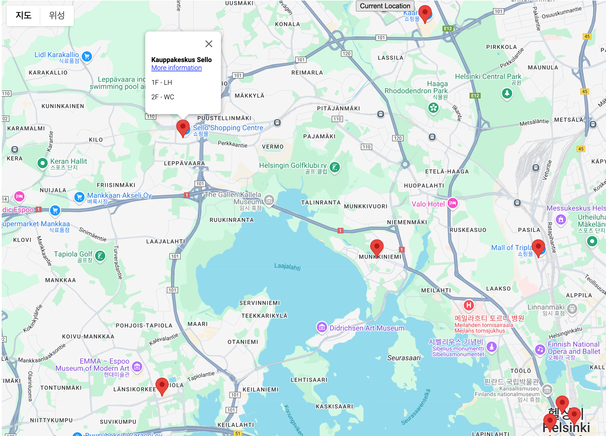

# Diaper Changers' Club App

**Diaper Changers' Club** is an app designed to help parents find diaper changing facilities near them in various public spaces. The app dynamically displays these locations on an interactive map, fetched from a MongoDB database, and uses the user's current location to show diaper changing places within a reasonable range.

## Features

- **Real-time Data Fetching**: The app pulls diaper changing facility data from a MongoDB database.
  - Locations' **coordinates** (latitude and longitude).
  - **Place information** such as floor names (e.g., "1F", "2F") and type (e.g., “LH” for Lactation Room).
  - **Location name** (e.g., "Kauppakeskus Sello").
  - **Additional information** links to more detailed content (e.g., opening hours, services).
  
- **Interactive Map**: The app integrates Google Maps to display diaper changing facilities as markers. Clicking on a marker shows an information window with more details about the facility.

- **Current Location Access**: The app uses the browser's geolocation API to fetch the user's current location and centers the map based on that. This feature ensures users can easily find facilities near them.

- **Nearby Facility Display**: Once the user's location is obtained, the app dynamically filters and shows nearby diaper changing locations, making it easier for parents to find accessible facilities.

## Workflow

1. **Map Initialization**: The app loads the Google Maps API and displays the map centered on a default location. Upon obtaining the user's current location, the map re-centers to the user’s position.

2. **Fetching Data from MongoDB**: The app fetches diaper changing location data from the backend API, which queries a MongoDB database containing essential details (coordinates, name, type, etc.).

3. **Marker Placement**: Each diaper changing facility is represented as a marker on the map. Clicking on a marker reveals an info window with:
   - Location name (e.g., "Kauppakeskus Sello").
   - Floor and type details (e.g., "Floor 1 - LH").
   - A link to additional information about the facility.

4. **Displaying Nearby Facilities**: The app checks the user’s current location and filters the facilities shown to only those within a specific range, making the app more useful by focusing on nearby diaper changing locations. 

## Screenshot
